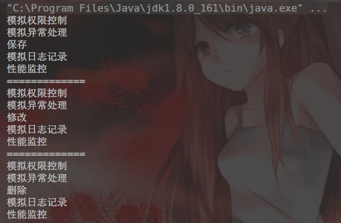
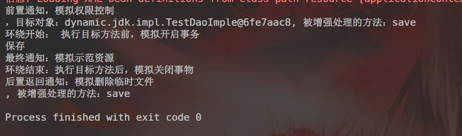

# Spring AOP

## 概念
  AOP(Aspect-OrientedProgramming）即面向切面编程，它与OOP(Object-OrientedProgramming，面向对象编程）相辅相成，提供了与OOP不同的抽象软件结构的视角。在OOP中，以类作为程序的基本单元，而AOP中的基本单元是Aspect（切面）。

## AOP术语

    1. 切面
        切面（Aspect）是指封装横切到系统功能（例如事务处理）的类。
    2. 连接点
        连接点Ooinpoint）是指程序运行中的一些时间点，例如方法的调用或异常的抛出。
    3. 切入点
        切入点CPointcut是指需要处理的连接点。在SpringAOP中，所有的方法执行都是连接点，而切入点是一个描述信息，它修饰的是连接点，通过切入点确定哪些连接点需要被处理。
    4. 通知
        通知（Advice）是由切面添加到特定的连接点（满足切入点规则）的一段代码，即在定义好的切入点处所要执行的程序代码，可以将其理解为切面开启后切面的方法，因此通知是切面的具体实现。
    5. 引人
        引入（Introduction允许在现有的实现类中添加自定义的方法和属性。。目标对象目标对象（TargetObject）是指所有被通知的对象。如果AOP框架使用运行时代理的方式（动态的AP）来实现切面，那么通知对象总是一个代理对象。
    6. 代理
        代理（Proxy）是通知应用到目标对象之后被动态创建的对象。
    7. 织人
        织入（Weaving）是将切面代码插入到目标对象上，从而生成代理对象的过程。根据不同实现技术，AOP织入有3种方式：编译期织入，需要有特殊的Java编译器；类装载期织入，需要有特殊的类装载器；动态代理织入，在运行期为目标类添加通知生成子类的方式。SpringAOP框架默认采用动态代理织入而AspectJ（基于Java语言的AOP框架）采用编译期织入和类装载期织入。
        
## 代理

### JDK动态代理
文件目录
```text
│  pom.xml
│  README.md
│
├─src
│  ├─main
│  │  ├─java
│  │  │  ├─aspect
│  │  │  │      MyAspect.java
│  │  │  │
│  │  │  └─dynamic
│  │  │      └─jdk
│  │  │          │  JDKDynamicTest.java
│  │  │          │  JDKDynarnicProxy.java
│  │  │          │  TestDao.java
│  │  │          │
│  │  │          └─impl
│  │  │                  TestDaoImple.java
│  │  │
│  │  └─resources
│  └─test
```
   
1. 创建接口TestDao
```java
public interface TestDao {
	public void save();

	public void nodify();

	public void delete();
}
```
2. 创建TestDaoImpl接口实现
```java
public class TestDaoImple implements TestDao {

	public void save() {
		System.out.println("保存");
	}

	public void nodify() {
		System.out.println("修改");
	}

	public void delete() {
		System.out.println("删除");
	}
}
```

3. 创建代理对象
```java
public class JDKDynarnicProxy implements InvocationHandler {

	private TestDao testDao;

	public Object createProxy(TestDao testDao){
		this.testDao = testDao;

		//1. 类加载器
		ClassLoader cld = JDKDynarnicProxy.class.getClassLoader();

		//2. 被代理对象实现的所有借口
		Class[] clazz = testDao.getClass().getInterfaces();

		//3. 使用代理类增强，返回代理后的对象
		return Proxy.newProxyInstance(cld,clazz,this);
	}


	/*
	 * 代理的逻辑方法，所有动态代理类的方法调用都交给该方法处理
	 * proxy是被代理对象
	 * method是将要被执行的方法
	 * args是执行方法时市耍的参数
	 * return指返回代理结果
	 */
	public Object invoke(Object proxy, Method method, Object[] args) throws Throwable {
		//1. 创建一个切面
		MyAspect myAspect = new MyAspect();
		//2. 前增强
		myAspect.check();
		myAspect.except();

		//3. 在目标类上调用方法并传入参数，相当于调用TestDao中的方法
		Object obj = method.invoke(testDao, args);

		//4. 后增强
		myAspect.log();
		myAspect.monitor();
		return obj;
	}


}
```

5. 创建测试类
```java
public class JDKDynamicTest {

	public static void main(String[] args) {
		//创建代理对象
		JDKDynarnicProxy jdkDynarnicProxy = new JDKDynarnicProxy();
		//创建目标对象
		TestDao testDao = new TestDaoImple();
		/**
		 * 从代理对象中获取增强后的目标对象，该对象是一个被代理的对象，它会进入代理的逻辑方法invoke中
		 */
		TestDao testDaoAdvice = (TestDao) jdkDynarnicProxy.createProxy(testDao);

		testDaoAdvice.save();
		System.out.println("=============");
		testDaoAdvice.nodify();
		System.out.println("=============");
		testDaoAdvice.delete();
	}
}
```
运行测试类，获得运行结果：



### CGLIB动态代理
1. 创建目标类TestDao
```java
public class TestDao {
	public void save() {
		System.out.println("保存");
	}

	public void nodify() {
		System.out.println("修改");
	}

	public void delete() {
		System.out.println("删除");
	}
}
```

2. 创建代理类
```java
public class CglibDynamicProxy implements MethodInterceptor {

	/**
	 * 创建代理的方法，生成CGLIB代理对象
	 * target是目标对象，需要增强的西乡
	 * 返回目标对象的CGLIB代理对象
	 * @param target
	 * @return
	 */
	public Object createProxy(Object target){
		//创建一个动态类对象，即增强类对象
		Enhancer enhancer = new Enhancer();
		//确定需要增强的类，设置其父类
		enhancer.setSuperclass(target.getClass());
		//确定代理逻辑对象为当前对象，要求当前对象实现MethodInterceptor的方法
		enhancer.setCallback(this);
		return enhancer.create();
	}

	/**
	 * @param o
	 * @param method
	 * @param objects
	 * @param methodProxy
	 * @return
	 * @throws Throwable
	 */
	public Object intercept(Object o, Method method, Object[] objects, MethodProxy methodProxy) throws Throwable {
		//创建一个切面
		MyAspect myAspect = new MyAspect();
		//前增强
		myAspect.check();
		myAspect.except();
		//目标方法执行，返回代理结果
		Object obj = methodProxy.invokeSuper(o,objects);
		//后增强
		myAspect.log();
		myAspect.monitor();
		return obj;
	}
}
```
3. 创建测试类
```java
public class CglibDynamicTest {
	public static void main(String[] args) {
		//创建代理对象
		CglibDynamicProxy cdp = new CglibDynamicProxy();

		//创建目标对象
		TestDao testDao = new TestDao();

		//获取增强后的目标对象
		TestDao testDaoAdvice = (TestDao) cdp.createProxy(testDao);

		//执行方法
		testDaoAdvice.save();
		System.out.println("=============");
		testDaoAdvice.nodify();
		System.out.println("=============");
		testDaoAdvice.delete();

	}
}
```

运行测试后结果与上相同

## 基于代理类的AOP实现

1. 通知类型可以分为6种类。
    1. 环绕通知
    环绕通知（org.aopalliance.intercept.Methodlnterceptor）是在目标方法执行前和执行后实施增强，可应用于日志记录、事务处理等功能。
    2. 前置通知
    前置通知（org.springframework.aop.MetodBeforeAdvice）是在标方法执行前实施增强，可应用于权限管理等功能。
    3. 后置返回通知
    后置返回通知（org.spring:framework.aop.AfterReturningAdvice）是在目标方法成功执行后实施增强，可用于关闭流、删除临时文件等功能。
    4. 后置(最终)通知
    后置通知（org.springframework.aop.AfterAdvice）是在目标方法执行后实施增强，与后置返回通知不同的是，不管是否发生异常都要执行该类通知，该类通知可应用于释放资源。
    5. 异常通知
    异常通知（org.springframework.aop.ThrowsAdvice）是在方法抛出异常后实施增强，可应用于处理异常、记录日志等功能。
    6. 引入通知
    引入通知（org.springframework.aop.Introductionlnterceptor）是在目标类中添加些新的方法和属性，可应用于修改目标类(增强类)。
2. ProxyFactoryBean

|属性|描述|
|---|---|
|target|代理的目标对象|
|proxyInterfaces|代理需要实现的接口列表，如果是多个接口，可以使用以下格式赋值：<br>\<list\><br>&nbsp;&nbsp;&nbsp;&nbsp;&nbsp;&nbsp;&nbsp;&nbsp;&nbsp;&nbsp;\<value\>\</value\><br>\<list\>|
|proxyTargetClass|是否对类代理而不是接口，默认为false，使用JDK动态代理，当为true时，使用CGLIB动态代理|
|singleton|返回的代理实例是否为单例，默认为true|
|optimize|当设置为true是强制使用CGLIB动态代理|
下面通过一个实现环绕通知的实例演示Spring使用ProxyFactoryBean创建AOP代理的过程。
<br>
文件目录
```text
│  pom.xml
│  README.md
├─src
│  ├─main
│  │  ├─java
│  │  │  ├─aspect
│  │  │  │      MyAspect.java
│  │  │  │
│  │  │  ├─dynamic
│  │  │  │  ├─cglib
│  │  │  │  │      CglibDynamicProxy.java
│  │  │  │  │      CglibDynamicTest.java
│  │  │  │  │      TestDao.java
│  │  │  │  │
│  │  │  │  └─jdk
│  │  │  │      │  JDKDynamicTest.java
│  │  │  │      │  JDKDynarnicProxy.java
│  │  │  │      │  TestDao.java
│  │  │  │      │
│  │  │  │      └─impl
│  │  │  │              TestDaoImple.java
│  │  │  │
│  │  │  └─spring
│  │  │      └─proxyfactorybean
│  │  │              MyAspect.java
│  │  │              ProxyFactoryBeanTest.java
│  │  │
│  │  └─resources
│  │          applicationContext.xml
│  │
│  └─test
│      └─java

```

1. 创建切面类MyAspect
```java
public class MyAspect implements MethodInterceptor {


	public void check(){
		System.out.println("模拟权限控制");
	}
	public void except(){
		System.out.println("模拟异常处理");
	}
	public void log(){
		System.out.println("模拟日志记录");
	}
	public void monitor(){
		System.out.println("性能监控");
	}


	public Object invoke(MethodInvocation methodInvocation) throws Throwable {
		//增强方法
		check();
		except();
		//执行目标方法
		Object obj = methodInvocation.proceed();
		//增强方法
		log();
		monitor();
		return obj;
	}

}
```

2. 配置切面并指定代理 applicationContext.xml
```java
<?xml version="1.0" encoding="UTF-8" ?>
<beans xmlns="http://www.springframework.org/schema/beans"
       xmlns:xsi="http://www.w3.org/2001/XMLSchema-instance"
        xsi:schemaLocation="http://www.springframework.org/schema/beans
                            http://www.springframework.org/schema/beans/spring-beans.xsd">
    <bean id="testDao" class="dynamic.jdk.impl.TestDaoImple"/>

    <bean id="myAspect" class="spring.proxyfactorybean.MyAspect"/>

    <bean id="testDaoProxy" class="org.springframework.aop.framework.ProxyFactoryBean">
        <!--指定代理实现的接口-->
        <property name="proxyInterfaces" value="dynamic.jdk.TestDao"/>
        <!--指定目标对象-->
        <property name="target" ref="testDao"/>
        <!--指定切面，织入环绕通知-->
        <property name="interceptorNames" value="myAspect"/>
        <!--指定代理方式，true指定CGLIB动态代理，默认为false，指定JDK动态代理-->
        <property name="proxyTargetClass" value="true" />
    </bean>

</beans>
```

3. 创建测试类ProxyFactoryBeanTest
```java
public class ProxyFactoryBeanTest {
	public static void main(String[] args) {
		ApplicationContext applicationContext = new ClassPathXmlApplicationContext("applicationContext.xml");
		TestDao testDao = (TestDao) applicationContext.getBean("testDaoProxy");

		testDao.save();
		testDao.nodify();
		testDao.delete();
	}
}
```

## 基于XML配置开发AspectJ
基于xml配置开发AspectJ是指通过XML配置文件定义切面，切入点及通知，所有这些定义都必须在\<aop:config\>元素内。\<aop:config\>元素及其子元素如下表
|元素名称|用途|
|---|---|
|\<aop:config\>|开发AspectJ的顶层配置元素，在配置文件的\<beans\>下可以包含多个该元素|
|\<aop:aspect\>|配置（定义）一个切面，\<aop:config\>元素的子元素，属性ref指定切面的定义|
|\<aop:pointcut\>|配置切入点，\<aop:aspect\>元素的子元素，属性expression指定通知增强那些方法|
|\<aop:before\>|配置前置通知，\<aop:aspect\>元素的子元素，属性method指定前置通知方法，属性pointcut-ref指定关联的切入点|
|\<aop:after-returning\>|配置后置通知，\<aop:aspect\>元素的子元素，属性method指定后置返回通知方法，属性pointcut-ref指定关联的切入点|
|\<aop:around\>|配置环绕通知，\<aop:aspect\>元素的子元素，属性method指定环绕通知方法，属性pointcut-ref指定关联的切入点，没有异常发生时将不会执行|
|\<aop:after\>|配置后置（最终）通知，\<aop:aspect\>元素的子元素，属性method指定后置（最终）通知方法，属性pointcut-ref指定关联的切入地|
|\<aop:declare-parents\>|给通知引入新的额外接口，增强功能|

示例：
文件目录：
```text
│  pom.xml
│  README.md
│
├─src
│  ├─main
│  │  ├─java
│  │  │  ├─aspect
│  │  │  │  │  MyAspect.java
│  │  │  │  │
│  │  │  │  └─xml
│  │  │  │          MyAspect.java
│  │  │  │          XMLAspectJTest.java
│  │  │  │
│  │  │  ├─dynamic
│  │  │  │  ├─cglib
│  │  │  │  │      CglibDynamicProxy.java
│  │  │  │  │      CglibDynamicTest.java
│  │  │  │  │      TestDao.java
│  │  │  │  │
│  │  │  │  └─jdk
│  │  │  │      │  JDKDynamicTest.java
│  │  │  │      │  JDKDynarnicProxy.java
│  │  │  │      │  TestDao.java
│  │  │  │      │
│  │  │  │      └─impl
│  │  │  │              TestDaoImple.java
│  │  │  │
│  │  │  └─spring
│  │  │      └─proxyfactorybean
│  │  │              MyAspect.java
│  │  │              ProxyFactoryBeanTest.java
│  │  │
│  │  └─resources
│  │          applicationContext.xml
│  │
│  └─test
│      └─java

```

1. 编写切面类MyAspect
```java
public class MyAspect {
	/**
	 * 前置通知，使用JoinPoint接口作为参数获得目标对象信息
	 */
	public void before(JoinPoint jp){
		System.out.println("前置通知，模拟权限控制");
		System.out.println("，目标对象："+jp.getTarget()
		+ ", 被增强处理的方法：" + jp.getSignature().getName());
	}

	/**
	 * 后置返回通知
	 */
	public void afterReturning(JoinPoint jp){
		System.out.println("后置返回通知：" + "模拟删除临时文件");
		System.out.println(", 被增强处理的方法：" + jp.getSignature().getName());
	}

	/**
	 * 环绕通知
	 * ProceedingJoinPoint是JoinPoint的子接口，代表可以执行的目标方法
	 * 返回值的类型必须是Object
	 * 必须一个参数是ProceedingJoinPoint类型
	 * 必须throwsThrowable
	 */
	public Object around(ProceedingJoinPoint pjp)throws Throwable{
		//开始
		System.out.println("环绕开始： 执行目标方法前，模拟开启事务");
		//执行当前目标方法
		Object obj = pjp.proceed();
		//结束
		System.out.println("环绕结束：执行目标方法后，模拟关闭事物");

		return obj;
	}

	/**
	 * 异常通知
	 */
	public void except(Throwable e){
		System.out.println("异常通知：" + "程序执行异常" + e.getMessage());
	}

	/**
	 * 后置（最终）通知
	 */
	public void after(){
		System.out.println("最终通知：模拟示范资源");
	}

}

```


2. 添加相关配置
```xml
    <bean id="myAspect" class="aspect.xml.MyAspect"/>

    <aop:config>
        <aop:aspect ref="myAspect">
            <!--配置切入点，通知增强哪些方法-->
            <aop:pointcut id="myPointCut" expression="execution(* dynamic.jdk.*.*(..))"/>

            <!--将通知于切入点关联-->
            <!--关联迁址通知-->
            <aop:before method="before" pointcut-ref="myPointCut" />
            <!--关联后置返回通知，在目标方法成功执行后执行-->
            <aop:after-returning method="afterReturning" pointcut-ref="myPointCut"/>
            <!--关联环绕通知-->
            <aop:around method="around" pointcut-ref="myPointCut"/>
            <!--关联异常通知：没有异常发生时不会执行增强，throwing属性设置通知的第二个参数名称-->
            <aop:after-throwing method="except" pointcut-ref="myPointCut" throwing="e"/>
            <!--关联后置（最终）通知，不管目标方法是否成功都要执行-->
            <aop:after method="after" pointcut-ref="myPointCut"/>

        </aop:aspect>
    </aop:config>
```

上述配置文件中，expression="execution(* dynamic.jdk.*.*(..））”是定义切入点表达式，该切入点表达式的意思是匹配dynamic.jdk包中任意类的任意方法的执行。其中，execution(*dynamic.jdk.＊卢（．．））是表达式的主体，第一个＊表示的是返回类型，使用＊代表所有类型；dynamic.jdk表示的是需要匹配的包名，后面第二个＊表示的是类名，使用＊代表匹配包中所有的类；第三个＊表示的是方法名，使用＊表示所有方法；后面的（．．）表示方法的参数，其中的“．．”表示任意参数。另外，注意第一个＊和包名之间有一个空格。

3. 创建测试类XMLAspectJTest
```java
public class XMLAspectJTest {
	public static void main(String[] args) {
		ApplicationContext applicationContext = new ClassPathXmlApplicationContext("applicationContext.xml");
		TestDao testDao = (TestDao) applicationContext.getBean("testDao");
		testDao.save();
	}
}
```

运行结果：



## 基于注解开发AspectJ

`AspectJ注解`
|注解名称|描述|
|---|---|
|@Aspect|用于定义一个切面，注解在切面类上|
|@Pointcut|用于定义切入点表达式，在使用时需要定义一个切入点方法，该方法是一个返回值void且方法体为空的普通方法|
|@Before|用于定义前置通知。在使用时通常为其指定value属性值，该值可以是已有的切入点，也可以直接定义切入点表达式|
|@AfterReturning|用于定义后置返回通知，在使用时通常为其指定value属性值，该值可以市一幼的切入点，也可以直接定义切入点表达式|
|@Around|用于定义环绕通知，在使用时通常为其指定value属性值，该值可以是已有的切入点，也可以直接定义切入点表达式|
|@AfterThrowing|用于定义异常通知，在使用时通常为其指定value属性值，该值可以市一幼的切入点，也可以直接定义切入点表达式，另外还有一个throwing属性用于访问目标方法抛出的异常，该属性值与异常通知方法中同名的形参一致|
|@After|用于定义后置（最终）通知，在使用时通常为其指定value属性值,该值可以市一幼的切入点，也可以直接定义切入点表达式|

示例：
1. 编写MyAspectJ
```java
//对应<aop:aspect ref="myAspect">
@Aspect
//对应<bean id="myAspect" class="aspectj.xml.MyAspect"/>
@Component
public class MyAspect {
	/**
	 * 定义切入点
	 */
	@Pointcut("execution(* dynamic.jdk.*.*(..))")
	private void myPointCut(){
		//对应  <aop:pointcut id="myPointCut" expression="execution(* dynamic.jdk.*.*(..))"/>
	}

	/**
	 * 前置通知，使用Joinpoint接口作为参数获得目标对象信息
	 */
	@Before("myPointCut())")
	//对应             <aop:before method="before" pointcut-ref="myPointCut" />
	public void before(JoinPoint jp){
		System.out.println("前置通知：模拟权限控制");
		System.out.println(", 目标类对象：" + jp.getTarget()
		+ ", 被增强处理的方法，" + jp.getSignature().getName());
	}


	/**
	 * 后置返回通知
	 * @param jp
	 */
	@AfterReturning("myPointCut()")
	//对应         <aop:after-returning method="afterReturning" pointcut-ref="myPointCut"/>
	public void afterReturning(JoinPoint jp){
		System.out.println("后置返回通知：" + "模拟删除临时文件");
		System.out.println(". 被增强处理的方法:" + jp.getSignature().getName());
	}


	/**
	 * 环绕通知*ProceedingJoinPoint是J o i n P o工n t的子接口，代表可以执行的目标方法
	 * 返回值的类型必须是Object
	 * 必须一个参数是ProceedingJoinPoint类型
	 * 必须throwsThrowable
	 */
	@Around("myPointCut()")
	public Object around(ProceedingJoinPoint pjp) throws Throwable {
		//开始
		System.out.println("环绕开始：执行目标方法前，模拟开启事物");
		//执行当前目标方法
		Object obj = pjp.proceed();
		//结束
		System.out.println("环绕结束：执行目标方法后，模拟关闭事物");
		return obj;
	}

	/**
	 * 异常通知
	 */
	@AfterThrowing(value = "myPointCut()", throwing = "e")
	public void except(Throwable e){
		System.out.println("异常通知：" + "程序执行异常" + e.getMessage());
	}

	/**
	 * 后置（最终）通知
	 */
	@After("myPointCut()")
	public void after(){
		System.out.println("最终通知：模拟释放资源");
	}


}

```

2. 给目标类(dynamic.jdk.TestDaoImpl)添加注解 @Repository("testDao")

3. 修改配置类，使注解生效，并启动基于注解的AspectJ支持
```xml
<?xml version="1.0" encoding="UTF-8" ?>
<beans xmlns="http://www.springframework.org/schema/beans"
       xmlns:xsi="http://www.w3.org/2001/XMLSchema-instance" xmlns:aop="http://www.springframework.org/schema/aop"
       xmlns:context="http://www.springframework.org/schema/context"
       xsi:schemaLocation="http://www.springframework.org/schema/beans
                            http://www.springframework.org/schema/beans/spring-beans.xsd http://www.springframework.org/schema/aop http://www.springframework.org/schema/aop/spring-aop.xsd http://www.springframework.org/schema/context http://www.springframework.org/schema/context/spring-context.xsd">
    <bean id="testDao" class="dynamic.jdk.impl.TestDaoImple"/>

    <!--&lt;!&ndash;<bean id="myAspect" class="spring.proxyfactorybean.MyAspect"/>&ndash;&gt;-->

    <!--<bean id="testDaoProxy" class="org.springframework.aop.framework.ProxyFactoryBean">-->
        <!--&lt;!&ndash;指定代理实现的接口&ndash;&gt;-->
        <!--<property name="proxyInterfaces" value="dynamic.jdk.TestDao"/>-->
        <!--&lt;!&ndash;指定目标对象&ndash;&gt;-->
        <!--<property name="target" ref="testDao"/>-->
        <!--&lt;!&ndash;指定切面，织入环绕通知&ndash;&gt;-->
        <!--<property name="interceptorNames" value="myAspect"/>-->
        <!--&lt;!&ndash;指定代理方式，true指定CGLIB动态代理，默认为false，指定JDK动态代理&ndash;&gt;-->
        <!--<property name="proxyTargetClass" value="true" />-->
    <!--</bean>-->

    <!--<bean id="myAspect" class="aspect.xml.MyAspect"/>-->

    <!--<aop:config>-->
        <!--<aop:aspect ref="myAspect">-->
            <!--&lt;!&ndash;配置切入点，通知增强哪些方法&ndash;&gt;-->
            <!--<aop:pointcut id="myPointCut" expression="execution(* dynamic.jdk.*.*(..))"/>-->

            <!--&lt;!&ndash;将通知于切入点关联&ndash;&gt;-->
            <!--&lt;!&ndash;关联迁址通知&ndash;&gt;-->
            <!--<aop:before method="before" pointcut-ref="myPointCut" />-->
            <!--&lt;!&ndash;关联后置返回通知，在目标方法成功执行后执行&ndash;&gt;-->
            <!--<aop:after-returning method="afterReturning" pointcut-ref="myPointCut"/>-->
            <!--&lt;!&ndash;关联环绕通知&ndash;&gt;-->
            <!--<aop:around method="around" pointcut-ref="myPointCut"/>-->
            <!--&lt;!&ndash;关联异常通知：没有异常发生时不会执行增强，throwing属性设置通知的第二个参数名称&ndash;&gt;-->
            <!--<aop:after-throwing method="except" pointcut-ref="myPointCut" throwing="e"/>-->
            <!--&lt;!&ndash;关联后置（最终）通知，不管目标方法是否成功都要执行&ndash;&gt;-->
            <!--<aop:after method="after" pointcut-ref="myPointCut"/>-->

        <!--</aop:aspect>-->
    <!--</aop:config>-->


    <!--指定需要扫描的包，使注解生效-->
    <context:component-scan base-package="aspect.annotation"/>
    <context:component-scan base-package="dynamic.jdk"/>
    <!--启动基于注解的AspectJ支持-->
    <aop:aspectj-autoproxy/>
</beans>
```

测试与结果和基于XML相同
